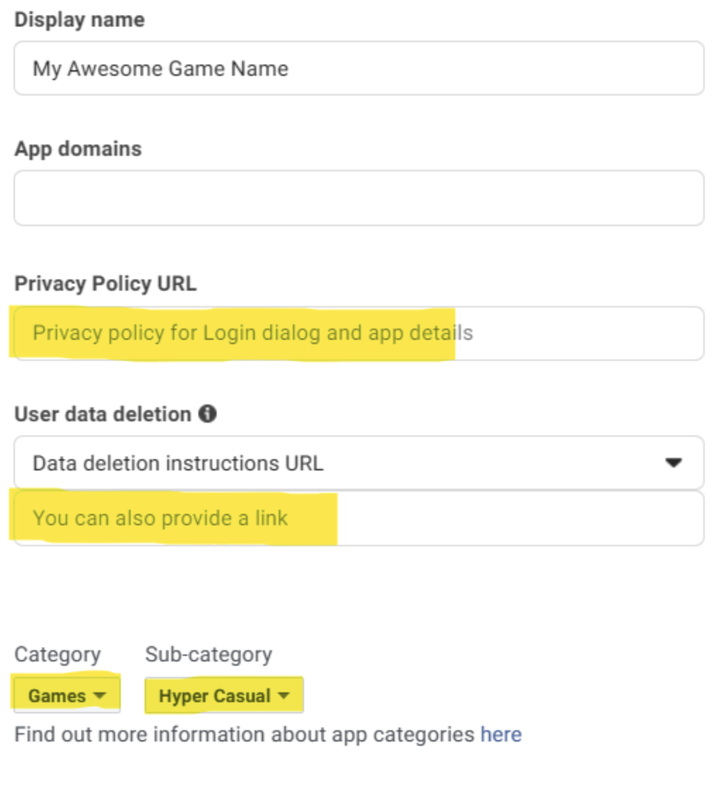
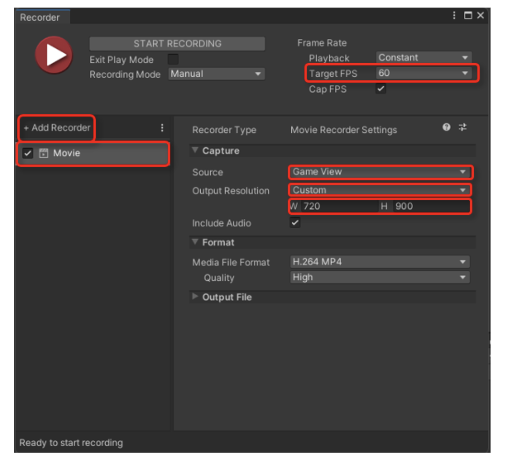

&nbsp;&nbsp;&nbsp;&nbsp;&nbsp;&nbsp;&nbsp;&nbsp;&nbsp;&nbsp;&nbsp;&nbsp;&nbsp;&nbsp;&nbsp;&nbsp;&nbsp;&nbsp;&nbsp;&nbsp;&nbsp;&nbsp;&nbsp;&nbsp;&nbsp;&nbsp;&nbsp;&nbsp;&nbsp;&nbsp;&nbsp;&nbsp;&nbsp;&nbsp;&nbsp;&nbsp;&nbsp;&nbsp;&nbsp;&nbsp;&nbsp;&nbsp;&nbsp;&nbsp;&nbsp;&nbsp;&nbsp;&nbsp;&nbsp;&nbsp;&nbsp;&nbsp;&nbsp;&nbsp;&nbsp;&nbsp;&nbsp;&nbsp;&nbsp;&nbsp;&nbsp;&nbsp;&nbsp;&nbsp;&nbsp;&nbsp;&nbsp;&nbsp;&nbsp;&nbsp;&nbsp;&nbsp;&nbsp;&nbsp;&nbsp;&nbsp;&nbsp;&nbsp;&nbsp;&nbsp;&nbsp;&nbsp;&nbsp;&nbsp;&nbsp;&nbsp;&nbsp;&nbsp;&nbsp;&nbsp;&nbsp;&nbsp;&nbsp;&nbsp;&nbsp;&nbsp;&nbsp;&nbsp;&nbsp;&nbsp;&nbsp;&nbsp;&nbsp;&nbsp;&nbsp;&nbsp;&nbsp;&nbsp;&nbsp;&nbsp;&nbsp;&nbsp;&nbsp;&nbsp;&nbsp;&nbsp;&nbsp;&nbsp;&nbsp;&nbsp;&nbsp;&nbsp;&nbsp;&nbsp;&nbsp;&nbsp;&nbsp;&nbsp;&nbsp;&nbsp;&nbsp;&nbsp;&nbsp;&nbsp;&nbsp;&nbsp;&nbsp;&nbsp;&nbsp;&nbsp;&nbsp;&nbsp;&nbsp;&nbsp;&nbsp;&nbsp;&nbsp;&nbsp;&nbsp;&nbsp;&nbsp;&nbsp;&nbsp;&nbsp;&nbsp;&nbsp;&nbsp;&nbsp;&nbsp;&nbsp;&nbsp;&nbsp;&nbsp;&nbsp;&nbsp;&nbsp;&nbsp;&nbsp;&nbsp;&nbsp;&nbsp;&nbsp;&nbsp;&nbsp;&nbsp;&nbsp;&nbsp;&nbsp;&nbsp;&nbsp;&nbsp;&nbsp;&nbsp;&nbsp;&nbsp;&nbsp;&nbsp;&nbsp;&nbsp;&nbsp;&nbsp;&nbsp;&nbsp;&nbsp;&nbsp;&nbsp;&nbsp;&nbsp;&nbsp;
 

# Welcome to MOONEE’s family! 🚀
### We've Been Expecting You!
Welcome aboard! Whether you're a seasoned developer or just starting out, this guide is tailored to help you navigate your journey within our developer community. Here, you'll find instructions, guidelines, and solutions to your technical inquiries.

Don't hesitate to reach out to us with any questions or requests for further information. We're here to support you and your team every step of the way, from prototyping to testing. Before committing extensive resources, we aim to gauge your app's potential in terms of retention, CPI, playtime, and other key performance indicators (KPIs).

Our test will target US users and will conclude within a maximum of 4 days, providing invaluable insights into your app's potential.

Remember, at MOONEE, data is paramount. It's the cornerstone of our decision-making process. We look forward to collaborating with you and leveraging data to drive success!

# Prototype Test Instructions

  
Table of Contents

  
  1. [System Requirements](#system-requirements)
  2. [Platform Settings](#platform-settings)  
    A. [Facebook](#facebook)  
    B. [Game Analytics](#game-analytics)  
  5. [Video Creatives](#video-creatives)
  6. [SDK Implementation](#sdk-implementation)
  7. [In-Game Fonts](#in-game-fonts)
  8. [DATA Safety](#data-safety)
  9. [Ready For Testing](#ready-for-testing)

## System Requirements

  

  
  - Unity Editor 2021.2 or higher (2021 LTS version)
  - Android:
    - Minimum SDK: Lollipop 5.0 (API 22)
    - Scripting backend: IL2CPP
  - iOS:
    - Target minimum iOS Version: 13.0
    - Scripting backend: IL2CPP

## Platform Settings

  

  It’s not mandatory for the game to be live yet in the store for this part.

  ### Facebook
  

    
Expand

#### 1: Creating a game in the [Facebook UI](https://developers.facebook.com/apps)

#### 2: Create an app

The following manual by Meta explains how to create an app: [Manual](https://developers.facebook.com/docs/development/create-an-app/)

When you need to choose the type of the app, choose "Other" > "Gaming app".

#### 3: Go to Settings > Basic and fill the needed info

#### 4: Create a valid privacy policy and User data deletion

  A. Create Privacy policy on: [this link](https://app-privacy-policy-generator.firebaseapp.com/)  
  B. After creating, download it and open it on Google Docs.  
  C. Under "File" choose "Publish to the web" and it will create you a Privacy Policy link.  
  D. Insert the created link on Both privacy policy and User data deletion sections, and choose the needed Category and Sub-Category (Hyper Casual, Hybrid etc.).

#### 5: Choose and add your platform

  A. Android: fill the package name (it’s the bundle), and on iOS fill App’s ID and Bundle ID.  
  B. Other sections or to confirm ownership are not mandatory so don’t worry about it!  
  C. Click “Save Changes”.
  

#### 6: Activate your app

Make sure to set the status on the first row to "Live".

#### 7: Add Moonee’s Ad Account ID

For us to be able to test your game, we need to connect it to our Ad Account:  
  a. Go to Settings -> Advanced and fill the needed info:  
  b. Scroll down to the section “Advertising Accounts” and insert Moonee’s Ad Account ID:`267507499172466`.

#### 8: Verify data

You can download + open the app and check on FB Developer main dashboard if you’re seeing data of last date installs.

#### 9: Share in the Slack channel your FB App ID.

  

  ### Game Analytics
  

    
Expand
  

1. Create a Game analytics account and asset using this [link](https://tool.gameanalytics.com/login?redirect=%252F).
2. If your game is level-based, make sure to have the events:
   - Start
   - Complete
   - Fail
3. Make sure to have the level events naming in the format:
   - “Level0001”
   - “Level0002”
   (Make sure to start from level 0001 and not from 0000)
4. Grant us Admin access to the app on Game Analytics: 
   - Settings -> Users -> Invite users -> for this user erez@moonee.io
  

## Video Creatives

  

  
1. Provide gameplay videos for ads (preferred via Google Drive) with game sounds (if there are ones).
2. Two videos are needed in a format of 1080x1350:
   A. Length of 2 minutes of different fails.
   B. Length of 3 minutes which include normal play, expert play, and satisfying moments (Unique scenes and highlights of the game).
3. Recording tips:
   - Please use the official Unity package called “Unity Recorder”. This package allows you to capture footage directly from the engine in all of the required resolutions, without any need for external software. You can install it from the package manager under the Unity Registry packages.
   - Once installed you can access it here (Window > General > Recorder > Recorder Window):
     
     
   - Click “Add Recorder” - make sure you add a Movie Sequence and remove the Image Sequence if there is one.
   - Source - Game View
   - Switch target fps to 60/30.
   - Make sure to change the output resolution to “Custom”. Change to the desired resolution (W1080xH1350) and record from the game view.
   - Press “Start Recording”, the game should start and the engine will record.
   - Reach your new captured footage file from the selected folder.
   - For further information regarding the tool, see the official unity guide: [About Unity Recorder](https://docs.unity3d.com/Packages/com.unity.recorder@3.0/manual/index.html).

## SDK Implementation

  

  
**Please remove all other SDK’s before implementing Moon SDK!**  

   1. Downloading the MOON SDK   
The current version of the MOON SDK is [version 1.3.5](https://drive.google.com/file/d/1jYZ65BiPbhzySEBcFSuwxP9EGQJkjsfM/view)     
**Notice: For this test use only Facebook, Game analytics and Adjust SDKs features!**
  2. Setting Up Moon SDK:

  3. Import MoonSDK.unitypackage into your unity project.
  
  4. The MoonSDKScene must be the first in the list in the build settings, after initialization it will load the next scene in the list (with index 1).

     
     
  5. Open MoonSDK settings and fill in all app keys for analytics and advertising services which you want to use and press Check and Sync Settings button
    
     
 
 6. Initialization: Moon SDK is initialized automatically from the Moon SDK scene.

 7. Progression Events:
    
**Levels progression events using Adjust and Moonee's Developer's Dahboard:**

      MoonSDK.SendLevelDataStartEvent((GameModel.levelIndex + 1).ToString());  
      MoonSDK.SendLevelDataCompleteEvent(LevelStatus.complete, (GameModel.levelIndex + 1).ToString(), LevelResult.win, isContinueLevel); 

**Levels progression events using GameAnalytics:**  

      void MoonSDK.TrackLevelEvents(MoonSDK.LevelEvents eventType, int levelIndex);
      MoonSDK.TrackLevelEvents(MoonSDK.LevelEvents.Start, 1);

 7. Make sure you filled the mandatory keys for the test under Facebook, Game Analytics and Adjust Basics section:
You will get the needed Adjust tokens from your Publisher Manager

## In-Game Fonts

  

  
In terms of in-game fonts, they must be official fonts from Google Fonts or Liberation Sans from Unity. Follow these steps to ensure compliance with font licensing:

1. Use only fonts from the Google Fonts library or Liberation Sans from Unity.
2. After selecting the relevant font, ensure you have the license for the game code as a text file.
3. Rename the license file to the following format: `Fontname_license.txt`.
4. Place both the font file and its license file in the Fonts directory of your project.
5. The most common font licenses are OFL (Open Font License) and Apache License.
6. Copy everything in the StreamingAssets directory to add a new licensed font, which will be automatically added to the build.
7. Fonts from Google Fonts can be used for both Android and iOS games. You can find them at [Google Fonts](https://fonts.google.com/).
8. Unity typically has two built-in fonts:
   * Liberation Sans (free to use)
   * Arial (note: Arial is not free to use)
9. Refer to the following guides for embedding custom fonts in games:
   * Unity - Manual: [Font Assets](https://docs.unity3d.com/Manual/class-Font.html).

By adhering to these guidelines, you ensure that your game uses licensed fonts responsibly and legally.

## DATA Safety

  

  
- For Android: 
Please make sure your app’s privacy and security practices match the store’s standards.   
Use this[how-to-Android-guide](https://docs.google.com/document/d/1xN6lX-wWwJfFPhiAr2oifMPD_mAtMWC39qZdFRv2uFY/edit)   
- For IOS:
Please make sure your app’s privacy and security practices match the store’s standards. 
Use this [how-to iOS-guide](https://docs.google.com/document/d/1FpO0OBE2uL9FS098HBX1sfBWrDMZFtc8t3dmmAclOGc/edit).

## Ready For Testing

  

  
1. Once you finish all of the above steps and your game is good to go, publish it on Google Play Store/ App Store.
2. Once the game is live, share in the Slack Channel the game’s store URL and its Facebook App ID.
3. Make sure you’ve done all the steps above
4. Get check for the following:
  - We are getting installs data from the app
  - We get levelDataStrat and levelDataComplete events from the app

# Good Luck! 

