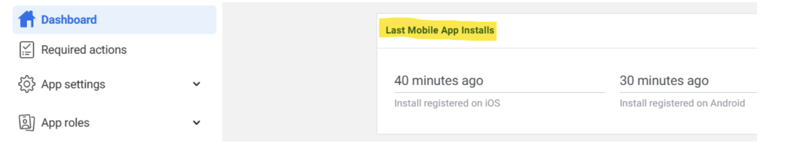

# Welcome to MOONEE’s family!
### We’ve been expecting you.

This guide is specially designed for new entrants to our developer community. It should provide you with instructions on how to, guidelines, and answers to your technical questions. 

Please feel free to contact us with any questions, to request further information about any issue or guidance you or your team might need, we will be guiding you and your studio through the whole process of releasing your prototype for testing. Before going with large resources, we want to test the potential of your app in terms of retention, CPI, Playtime and additional KPI’s. The test will be targeting US users and will take us Max 4 days to determine KPI’s.

The KPI’s will determine the game’s potential and provide critical DATA. 
DATA is MOONEE’s key for decision making. 

# Prototype Test Instructions:   
**Please remove all other SDK’s before implementing Moon SDK!**
#
1. System Requirements
2. Platforms Settings
   1. Facebook (9 steps)
   2. Game Analytics (4 steps)
4. Video Creatives
5. SDK Implementation
6. DATA Safety
7. Ready For Testing

## 1. System Requirements
- Unity Editor 2021.2 or higher 2021 LTS version
- Android:
  Minimum SDK: Lollipop 5.0 (API 22)  
  Scripting backend: IL2CPP
- iOS: 
  Target minimum iOS Version: 13.0   
  Scripting backend: IL2CPP
  
## 2. Platforms Settings
It’s Not mandatory for the game to be live yet in the store for this part  
### Facebook
Make sure to follow all the following steps:  

#### Facebook step 1. Creating a game in the facebook UI:    
[https://developers.facebook.com/apps](https://developers.facebook.com/apps)  
#
#### Facebook step 2. Create an app:
The following manula by Meta is explaning how to create an app.
[https://developers.facebook.com/docs/development/create-an-app/](https://developers.facebook.com/docs/development/create-an-app/)  
When you need to choose they type of the app, choose the Other > Gaming app. 
#
#### Facebook step 3. Go to Settings > Basic and fill the needed info
#
#### Facebook step 4. Create a valid privacy policy and User data deletion:  
&nbsp;&nbsp;&nbsp;A. Create Privacy policy on: [https://app-privacy-policy-generator.firebaseapp.com/](https://app-privacy-policy-generator.firebaseapp.com/)  
&nbsp;&nbsp;&nbsp;B. After creating, downloading it and opening it on Google Docs.   
&nbsp;&nbsp;&nbsp;C. Under "File" choose "Publish to the web" and it will create you a Privacy Policy link.  
&nbsp;&nbsp;&nbsp;d. Insert the created link on Both privacy policy and User data deletion sections, and choose the needed Category and Sub-Category (Hyper Casual, Hybrid etc.).  
&nbsp;&nbsp;&nbsp;&nbsp;&nbsp;&nbsp;&nbsp;&nbsp;&nbsp;&nbsp;
#
#### Facebook step 5. Choose and add your platform: 
&nbsp;&nbsp;&nbsp;A. Android fill the package name (it’s the bundle), and on IOS fill App’s ID and Bundle ID.  
&nbsp;&nbsp;&nbsp;B. Other sections or to confirm ownership are not mandatory so don’t worry about it!  
&nbsp;&nbsp;&nbsp;D. Click “Save Changes”  
&nbsp;&nbsp;&nbsp;&nbsp;&nbsp;&nbsp;&nbsp;
#
#### Facebook step 6. Activate your app 
Make sure to set the status on the first row to”Live”
&nbsp;&nbsp;&nbsp;&nbsp;&nbsp;&nbsp;&nbsp;
#
#### Facebook step 7. Add Moonee’s Ad Account ID
For us to be able to test your game, we need to connect it to our Ad Account:
&nbsp;&nbsp;&nbsp;a. Go to Settings -> Advanced and fill the needed info:
&nbsp;&nbsp;&nbsp;a. Scroll down to the section “Advertising Accounts” and insert Moonee’s Ad Account ID:`267507499172466`
&nbsp;&nbsp;&nbsp;&nbsp;&nbsp;&nbsp;&nbsp;
#
#### Facebook step 8. Verify data
You can download + open the app, and check on FB Developer main dashboard, if you’re seeing data of last date installs:
&nbsp;&nbsp;&nbsp;&nbsp;&nbsp;&nbsp;&nbsp;
#
#### Facebook step 9. Share in the Slack channel your FB App ID.
#
### Game Analytics 
1. Create a Game analytics account and asset using this [link](https://tool.gameanalytics.com/login?redirect=%252F).
2. If your game is level based, make sure to have the events:
    - Start
    - Complete
    - Fail
3. Make sure to have the level events naming in the format:
    - “Level0001”
    - “Level0002”
- Make sure to start from level 0001 and not from 0000
4. Grant us Admin access to the app on Game Analytics: 
    - Settings -> Users -> Invite users -> for this user erez@moonee.io

## 3. Video Creatives
1. Provide gameplay videos for ads (preferred via Google Drive) with game sounds (if there are ones)
2. Two videos are needed in a Format of 1080X1350:
&nbsp;&nbsp;&nbsp;A. Length of 2 minutes of different fails.
&nbsp;&nbsp;&nbsp;B. Length of 3 minutes which include normal play, expert play and satisfying moments (Unique scenes and highlights of the game).
3. Recording tips: 
Please use the official Unity package called “Unity Recorder”.
This package allows you to capture footage directly from the engine in all of the required resolutions, without any need for external software. You can install it from the package manager under the Unity Registry packages.    
  - Once installed you can access it here (Window > General > Recorder > Recorder Window):
&nbsp;&nbsp;&nbsp;&nbsp;&nbsp;&nbsp;&nbsp;
&nbsp;&nbsp;&nbsp;&nbsp;&nbsp;&nbsp;&nbsp;
  - Click “Add Recorder” - make sure you add a Movie Sequence and remove the Image Sequence if there is one. 
  - Source - Game View
  - Switch target fps to 60/30 .
  - Make sure to change the output resolution to “Costum”. Change to the desired resolution (W1080xH1350) and record from the game view.
  - Press “Start Recording”, the game should start and the engine will record.
  - Reach your new captured footage file from the selected folder.
  - For further information regarding the tool, see the official unity guide: About Unity recorder.

## 4. SDK Implementation
### 1. Downloading the MOON SDK
The current version of the MOON SDK is [version 1.3.5](https://drive.google.com/file/d/1jYZ65BiPbhzySEBcFSuwxP9EGQJkjsfM/view) 
**Notice: For this test use only Facebook, Game analytics and Adjust SDKs features!**

#
### 2. Setting Up Moon SDK

  1. Import MoonSDK.unitypackage into your unity project.
  
  2. The MoonSDKScene must be the first in the list in the build settings, after initialization it will load the next scene in the list (with index 1).

     
     
  3. Open MoonSDK settings and fill in all app keys for analytics and advertising services which you want to use and press Check and Sync Settings button
    
     
 
 4. Initialization: Moon SDK is initialized automatically from the Moon SDK scene.

 5. Progression Events:   
**Levels progression events using Adjust and Moonee's Developer's Dahboard:**  
`MoonSDK.SendLevelDataStartEvent((GameModel.levelIndex + 1).ToString());`  
`MoonSDK.SendLevelDataCompleteEvent(LevelStatus.complete, (GameModel.levelIndex + 1).ToString(), LevelResult.win, isContinueLevel);`  
**Levels progression events using GameAnalytics:**  
`void MoonSDK.TrackLevelEvents(MoonSDK.LevelEvents eventType, int levelIndex);`
`MoonSDK.TrackLevelEvents(MoonSDK.LevelEvents.Start, 1);`

 7. Make sure you filled the mandatory keys for the test under Facebook, Game Analytics and Adjust Basics section:
You will get the needed Adjust tokens from your Publisher Manager

## 5. DATA Safety

- For Android: 
Please make sure your app’s privacy and security practices match the store’s standards.   
Use this[how-to-Android-guide](https://docs.google.com/document/d/1xN6lX-wWwJfFPhiAr2oifMPD_mAtMWC39qZdFRv2uFY/edit)   
- For IOS:
Please make sure your app’s privacy and security practices match the store’s standards. 
Use this [how-to iOS-guide](https://docs.google.com/document/d/1FpO0OBE2uL9FS098HBX1sfBWrDMZFtc8t3dmmAclOGc/edit).

## 6. Ready For Testing

1. Once you finish all of the above steps and your game is good to go, publish it on Google Play Store/ App Store.
2. Once the game is live, share in the Slack Channel the game’s store URL and its Facebook App ID.
3. Make sure you’ve done all the steps above
4. Get check for the following:
  - We are getting installs data from the app
  - We get levelDataStrat and levelDataComplete events from the app

# Good Luck! 

