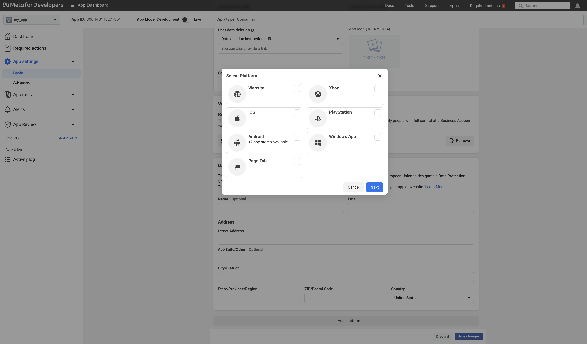

                                                                                                                                                                                                       
 

# Welcome to MOONEE’s family! 🚀
### We've Been Expecting You!
Welcome aboard! Whether you're a seasoned developer or just starting out, this guide is tailored to help you navigate your journey within our developer community. Here, you'll find instructions, guidelines, and solutions to your technical inquiries.

Don't hesitate to reach out to us with any questions or requests for further information. We're here to support you and your team every step of the way, from prototyping to testing. Before committing extensive resources, we aim to gauge your app's potential in terms of retention, CPI, playtime, and other key performance indicators (KPIs).

Our test will target US users and will conclude within a maximum of 5 full days, providing invaluable insights into your app's potential.

Remember, at MOONEE, data is paramount. It's the cornerstone of our decision-making process. We look forward to collaborating with you and leveraging data to drive success!

### The current version of the Moon Light SDK is 1.0.4
Published at 04.09.2024

In this version we updated the following:  
1. Error fixing

# Prototype Test Instructions

  
Table of Contents

  
  1. [System Requirements](#system-requirements)
  2. [Platform Settings](#platform-settings)  
    A. [Facebook](#facebook)  
    B. [Game Analytics](#game-analytics)  
  5. [Video Creatives](#video-creatives)
  6. [SDK Implementation](#sdk-implementation)
  7. [Progression Events](#progression-events)
  8. [Commen Issues](#commen-issues)
  9. [In-Game Fonts](#in-game-fonts)
  10. [DATA Safety](#data-safety)  
      A. [Android](#android)  
      B. [iOS](#ios)  
      C. [Facebbok Data Checkup](#facebbok-data-checkup)  
  11. [Ready For Testing](#ready-for-testing)

## System Requirements

  

  
  - Unity Editor 2022 or higher (2022 LTS version)
  - Android:
    - Minimum SDK: Lollipop 5.0 (API 22)
    - Scripting backend: IL2CPP
  - iOS:
    - Target minimum iOS Version: 13.0
    - Scripting backend: IL2CPP
  - Xcode should be the most updated
  - 

## Platform Settings

  ### Facebook
  

    
Expand

#### 1: Sign in the [Facebook UI](https://developers.facebook.com/apps)

#### 2: Create an app
Press "Create app"  
    
The following manual by Meta explains how to create an app: [Manual](https://developers.facebook.com/docs/development/create-an-app/)

#### 3: Use cases:
When asked "What do you want your app to do?" Choose "other"  
  

#### 4: App details: 
Choose "Consumer" 

#### 5: Create a valid privacy policy and User data deletion

  A. Create Privacy policy on: [this link](https://app-privacy-policy-generator.firebaseapp.com/)  
  B. After creating, download it and open it on Google Docs.  
  C. Under "File" choose "Publish to the web" and it will create you a Privacy Policy link.  
  D. Go to "App Setting / Basic" 
  D. Insert the created link on Both privacy policy and User data deletion sections, and choose the needed Category and Sub-Category (Hyper Casual, Hybrid etc.).

#### 6: Choose and add your platform

  A. Go to "App Setting / Basic"
  B. Scroll to the bottom 
  C. See "+ Add Platform"
  D. Android: fill the package name (it’s the bundle),
  E. iOS: fill App’s ID and Bundle ID.  
  F. Other sections or to confirm ownership are not mandatory so don’t worry about it!  
  G. Click “Save Changes”.
   
   
   

#### 7: Activate your app

Make sure to set the status on the first row to "Live".

#### 8: Add Moonee’s Ad Account ID

For us to be able to test your game, we need to connect it to our Ad Account:  
  a. Go to Settings -> Advanced and fill the needed info:  
  b. Scroll down to the section “Advertising Accounts” and insert Moonee’s Ad Account ID:`267507499172466`.

#### 9: Verify data

You can download + open the app and check on FB Developer main dashboard if you’re seeing data of last date installs.

#### 10: Share IDs in the Slack Channel:
1. Log into the [Meta developer portal.](https://developers.facebook.com/) 
2. Navigate to My Apps in the top right corner.
3. Select the app for which you would like to access your decryption key.
4. Select Settings > Basic.
5. Scroll to the Android section.
6. Look for Install Referrer Decryption Key under the Google Play header.
7. Copy the Install Referrer Decryption Key and the Facebook App ID and share them in the slack channel

#### 11: Add Moonee members to the meta app:
Accounts:  
1. ruth.adler.2021 OR ruth.a@moonee.io  
2. nadav.k19  OR nadav.k@moonee.io  
3. facundourq.m OR facundo.u@moonee.io  

  

  ### Game Analytics 
  

    
Expand

    
Game Analytics data serves as a crucial tool for determining retention rates and playtime. Progression events are instrumental in this determination, operating within the backend infrastructure. Currently, it's imperative that every level (or minute, particularly in Idle games) incorporates Game Analytics events and Adjust events for optimal tracking and analysis.
The SDK is sending the events automatically to GA from progression events part. If for some reason this is not working, let us know. 
This section is here for cases where you are not using the events methods.

1. Create a Game analytics account and asset using this [link](https://tool.gameanalytics.com/login?redirect=%252F).
2. If your game is level-based, make sure to have the events:
   - Start
   - Complete
   - Fail
3. Make sure to have the level events naming in the format:
   - “Level0001”
   - “Level0002” 
   (Make sure to start from level 0001 and not from 0000)
4. Grant us Admin access to the app on Game Analytics: 
   - Settings -> Users -> Invite users -> for this user erez@moonee.io
  

## Video Creatives

  

Please check all the following points before sending the recordings—it’ll make the process smoother for everyone!
  
  ### 📏 Size Requirements
  - **Resolution:** `1080x1350`
  - **File Format:** `MP4`
  - **Platform Compatibility:** We’re testing on **Facebook**, so ensure that all UI elements and game details are visible and not cut off. Keep file sizes manageable for easy downloading.

  ### 🔊 Sound Guidelines
  - **Music:** Avoid adding background music. We’ll test various music options ourselves, but if you have a preferred track, feel free to send it separately.
  - **Game Sounds:** Include in-game sounds that add satisfaction to gameplay. These tend to improve performance in creatives, so be sure all game sounds are present.

  ### ⏰ Length Preferences
  - **Duration:** Keep videos **above 30 seconds**.
  - **Editing Flexibility:** Although we’ll edit as needed, we prefer full level playthroughs and a variety of content to select from.

  ### 🎮 Content Requirements
  - **Fails & Wins:** Capture both **fail** and **win** moments. Ideally, provide two versions—one highlighting failures and the other victories.
  - **Background:** Use a **green background** if possible, allowing us more flexibility to test variations.
  - **Tutorial Hand:** Include a tutorial hand animation, This helps new users understand the game quickly. Right-click to open in a new tab and download. [File 1](images/Pencil.png) [File 2](images/applepencil-story.png). 
  - **Gameplay Variety:** Showcase game boosters, upgrades, and different locations. Avoid slow gameplay; highlight exciting moments to keep the content engaging.

  ### 🎥 Recording Tips
  - **Use Unity Recorder:** We recommend using the official **Unity Recorder** package. It captures footage directly from the engine in the required resolutions, eliminating the need for external software. Install it from the **Unity Package Manager** under Unity Registry packages.
  - **Accessing Unity Recorder:**
    - Go to **Window > General > Recorder > Recorder Window**:
      
      
  - **Setup Steps:**
    - Click **Add Recorder** – choose **Movie Sequence** and remove any **Image Sequence**.
    - Set **Source** to **Game View**.
    - Adjust **FPS** to 60/30.
    - Select output resolution as **Custom** (`W1080xH1350`) and record from **Game View**.
  - **Start Recording:** Once setup is complete, press **Start Recording**. The footage will save to your designated folder.

  For further assistance, refer to the official Unity documentation: [Unity Recorder Guide](https://docs.unity3d.com/Packages/com.unity.recorder@3.0/manual/index.html).

## SDK Implementation

  

  
**Please remove all other SDK’s before implementing Moon SDK!**    

   1. Downloading the MOON SDK   
The current version of the MOON Light SDK is version 1.0.3  (link is sent by slack bot)  
**Notice: For this test use only Facebook, Game analytics and Adjust SDKs features!**
  2. Setting Up Moon SDK:

  3. Import MoonSDK.unitypackage into your unity project.
  
  4. The MoonSDKScene must be the first in the list in the build settings, after initialization it will load the next scene in the list (with index 1).

     
     
  5. Use only Facebook, Game Analytics and Adjust Basic.  

     
    
  6. Open MoonSDK settings and fill in all app keys for analytics and advertising services which you want to use and press Check and Sync Settings button
    
     
 
 7. Initialization: Moon SDK is initialized automatically from the Moon SDK scene.

    
## Progression Events

  

  
**Levels progression events sends events to Adjust and Game Analytics:**  
We utilize two key events related to game level progression: `LevelDataStartEvent` and `LevelDataCompleteEvent`.

`LevelDataStartEvent` is sent at the beginning of the level
1. `coinsAmount` - Indicates the main currency current amount (In level 1, if the users start with 0, send 0.)
2. `purchaseIDs` - Indicates which in-app purchases the user made before starting this level, since the last time this event was sent.

Use it as described below:

     MoonSDK.SendLevelDataStartEvent(levelIndex, coinsAmount, purchaseIDs);

`LevelDataCompleteEvent`  is sent at the end of the level:
1. `LevelStatus` - Indicates the current status of the level, which could be "start" when the level begins, "fail" if the player fails to complete it, or "complete" if the player finishes it without winning.
2. `levelIndex` - Indicates level index, Make sure to send it as 1 int. Since we are sending that to GA, the SDK will trasfer that to 0001 to be allgned with Game Analytics format. Make sure to start from level 1 and not from 0.
3. `LevelResult` - Represents the outcome of the level, which could be "win" if the player successfully completes it or "fail" if the player fails to complete it.
4. `isContinue` - A boolean argument that indicates whether the player is continuing the level from where they left off (true) or starting it from the beginning (false). This is particularly useful for long idle levels or when there's a revive   
     option. If the game doesn't have these features, it should be set to false by default.
5. `coinsAmount` - Shows the current amount of the main currency once the level is completed. I played level 1, during the level got 10 and lost 5. In the complete screen I was given 2 more. you should send: 10-5+2 = 7.  
6. `movesAmount` - The number of moves the player made to complete the level.

Use it as described below:

     MoonSDK.SendLevelDataCompleteEvent(LevelStatus.complete, levelIndex, LevelResult.win, isContinue, coinsAmount, movesAmount);

For the in game store data, use the following (the rest is aoutomatic):

      MoonSDK.OpenInGameStore(); // Execute when user opens the store
      MoonSDK.CloseInGameStore(); // Execute when user closes the store

For the in game store data, use the following (the rest is aoutomatic):

      MoonSDK.OpenInGameStore(); // Execute when user opens the store
      MoonSDK.CloseInGameStore(); // Execute when user closes the store

**Note!** Rememeber to add every Rewarded Video you are using!   
Adding the folowing part `"rewardedVideoName");` at the end of the function mentioned [here](#rewarded-video-ads-api)
      
**Note**: In this part it is crutial to check:  
     - **A.** Token to Adjust for EACH event  
     - **B.**  No spaces before and after the token    
     - **C** Make sure to **copy/paste** the tokens!!!   
     

## Commen Issues

  

  
Commen issues can be found here as well as in the "issue" section.  
Please add your comments there as well, to allow other to gain from it.  

**Importnat comments:**
1. Please remove External Dependency manager folder from the project and import the latest one.
2. After adding the keys and tokens, make sure **not** to disable the checkmarks for the basic.
3. Use only Facebook, Game Analytics and Adjust Basic. Leave all other sections in the inspector unmarked.
4. If you encounter any issues with Firebase, Applovin or any other, remove the check mark from the corresponding box in that section.
5. Use both methods of progression events: to Adjust and to Game Analytics. Soon we will be changing it to one method sending to both platforms.
6. When updating the SDK version, pleaese remove MoonSDK folder and after that import the new package.
7. If you are reciving an error of an adaptor: missing id, or anyother adaptor case, remove that missed downloaded adptor.
8. Since you are not using monetization you need to remove Google Adapter, See how in SDK implementations section. 

## In-Game Fonts

  

  
In terms of in-game fonts, they must be official fonts from Google Fonts or Liberation Sans from Unity. Follow these steps to ensure compliance with font licensing:

1. Use only fonts from the Google Fonts library or Liberation Sans from Unity.
2. After selecting the relevant font, ensure you have the license for the game code as a text file.
3. Rename the license file to the following format: `Fontname_license.txt`.
4. Place both the font file and its license file in the Fonts directory of your project.
5. The most common font licenses are OFL (Open Font License) and Apache License.
6. Copy everything in the StreamingAssets directory to add a new licensed font, which will be automatically added to the build.
7. Fonts from Google Fonts can be used for both Android and iOS games. You can find them at [Google Fonts](https://fonts.google.com/).
8. Unity typically has two built-in fonts:
   * Liberation Sans (free to use)
   * Arial (note: Arial is not free to use)
9. Refer to the following guides for embedding custom fonts in games:
   * Unity - Manual: [Font Assets](https://docs.unity3d.com/Manual/class-Font.html).

By adhering to these guidelines, you ensure that your game uses licensed fonts responsibly and legally.

## DATA Safety

  

### Android

  

To complete the Data Safety form required by the Google Store, please adhere to the following steps:

Access the Google Play Console for your application.
Navigate to the "Data safety" section within the console.
Answer the questions as below:  

**Overview:**  
Please read the following instructions carefully to ensure that you are not collecting data beyond the parameters outlined below. If, however, you find that you are inadvertently collecting additional data, please promptly contact us for further assistance. It is essential to adhere strictly to the specified data collection guidelines to maintain compliance and transparency with our policies.  

**Data collection and security:**  
Does your app collect or share any of the required user data types? _Yes_
  - Is all of the user data collected by your app encrypted in transit? _Yes_
  - Which of the following methods of account creation does your app support? _My app does not allow users to create an account_
  - Do you provide a way for users to request that their data is deleted? (Optional) _No_ 

**Data types:**  
Select all of the user data types collected or shared by your app.
- Location: _None_
- Personal info: _None_
- Financial info: _None_
- Health and fitness: _None_
- Messages: _None_
- Photos and videos: _None_
- Audio files: _None_
- Files and docs: _None_
- Calendar: _None_
- Contacts: _None_
- App activity: App interactions (Information about how a user interacts with your app. For example, the number of times they visit a page, or what they tap on.)
- Web browsing: _None_
- App info and performance: Crash logs
- Device or other IDs: Device or other IDs

**Data usage and handling** _Manage in the errow for both types:_

App Activity / App interactions:
  - Is this data collected, shared, or both? _Collected_
  - Is this data processed ephemerally? _Yes, this collected data is processed ephemerally_
  - Is this data required for your app, or can users choose whether it's collected? _Data collection is required_
  - Why is this user data collected? App functionality, Analytics, Advertising or marketing

Device or other IDs:
  - Is this data collected, shared, or both? _Collected_
  - Is this data processed ephemerally? _Yes, this collected data is processed ephemerally_
  - Is this data required for your app, or can users choose whether it's collected? _Data collection is required_
  - Why is this user data collected? _App functionality, Analytics, Advertising or marketing_
    
**Preview:**  
See that all of the above is correct, and press save.
If you can't see the save button, there are 3dots there, that "save" is one othe options in them.

### iOS

  

To complete the Data Safety form required by the App Store, please adhere to the following steps:

Access the App Play Connect for your application.
Navigate to the "App Privacy" section within the console.
Answer the questions as below:  

**Privacy Policy**  
User Privacy Choices URL: Please provide Moonne's URL: https://moonee.io/privacy-policy/

**Data Collection**  
Do you or your third-party partners collect data from this app? _Yes, we collect data from this app_

**Data Types**  
- Contact Info: _None_
- Health & Fitness: _None_
- Financial Info: _None_
- Location: _None_
- Sensitive Info: _None_
- Contacts: _None_
- User Content: _None_
- Browsing History: _None_
- Search History: _None_
- Identifiers: _Device ID_
- Usage Data: _Product Interaction,Advertising Data_
- Diagnostics: _Crash Data, Performance Data_
- Surroundings: _None_
- Body: _None_
- Other Data: _None_

Identifiers/ Device ID:
- Indicate how device IDs collected from this app are being used by you or your third-party partners? _Third-Party Advertising,Developer’s Advertising or Marketing_
- Are the device IDs collected from this app linked to the user’s identity? _No, device IDs collected from this app are not linked to the user’s identity_
- Do you or your third-party partners use device IDs for tracking purposes? _Yes, we use device IDs for tracking purposes_

Usage Data/ Product Interaction:
- Indicate how Product Interaction collected from this app are being used by you or your third-party partners? _Third-Party Advertising, Developer’s Advertising or Marketing, Analytics,Product Personalization, App Functionality_
- Are the Product Interaction data collected from this app linked to the user’s identity? _No, Product Interaction data collected from this app are not linked to the user’s identity_
- Do you or your third-party partners use device IDs for tracking purposes? _Yes, we use device IDs for tracking purposes_

Usage Data/ Advertising Data:
- Indicate how Advertising Data collected from this app are being used by you or your third-party partners? _Third-Party Advertising,Developer’s Advertising or Marketing, Analytics,Product Personalization, App Functionality_
- Are the Advertising Data collected from this app linked to the user’s identity? _No, Advertising Data collected from this app are not linked to the user’s identity_
- Do you or your third-party partners use Advertising Data for tracking purposes? _Yes, we use Advertising Data for tracking purposes_

Diagnostics/ Crash Data:
- Indicate how crash data collected from this app are being used by you or your third-party partners? _Developer’s Advertising or Marketing, Analytics_
- Are the crash data collected from this app linked to the user’s identity? _No, crash data collected from this app are not linked to the user’s identity_
- Do you or your third-party partners use crash data for tracking purposes? _Yes, we use crash data for tracking purposes_

Diagnostics/ Performance Data:
- Indicate how performance data collected from this app are being used by you or your third-party partners? _Third-Party Advertising, Developer’s Advertising or Marketing, Analytics,Product Personalization, App Functionality_
- Are the performance data collected from this app linked to the user’s identity? _No, performance data collected from this app are not linked to the user’s identity_
- Do you or your third-party partners use performance data for tracking purposes? _Yes, we use performance data for tracking purposes_

  

### Facebbok Data heckup 

  

  
In case the Facebook UI is asking to craete data check up, use the following:  
Go to [https://developers.facebook.com/]  
Sign in and go to the app, the Data checkup will pop up  
1. Click on your app and press next  
  
2. Under Do you have data controller choose No, Add data processor  
  
3. Insert Moonee Publishing LTD as your data processor. From the category choose Advertising and Analytics and measurement. From the list of countries choose Israel and Poland  
  
  
4. For Have you provided the personal data of user to public authorities choose No, and for Which of the following processes do you have in place choose Required review of the legality of these requests and press next/  
  
5. Tick all the boxes and press next.  
  
6. Insert the Google Play store link and fill in the answers to the rest of the questions as following:  
  
7. Same for iOS, insert the App Store link and fill in the answesr to the rest of the questions as following:  
  
8. Tick the box and finish the checkup  
  

## Ready For Testing

  

  
1. Once you finish all of the above steps and your game is good to go, publish it on Google Play Store/ App Store.
2. Once the game is live, share in the Slack Channel the game’s store URL and its Facebook App ID.
3. Make sure you’ve done all the steps above
4. Get check for the following:
  - We are getting installs data from the app
  - We get levelDataStrat and levelDataComplete events from the app

# Good Luck! 

