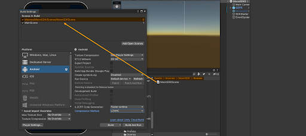

# Welcome to Monnee's Hub!
Your gateway to endless gaming possibilities!

## Manual for Monitization Phase
### Table of content 
  1. System Requirements
  2. Downloading the MOON SDK
  3. Setting Up Moon SDK
  4. Initialization
  5. Displaying Ads
  6. Analytics
  7. Firebase Configuration
  8. Firebase Remote Configuration
  9. Adjust events
  10. Progression events
  11. Rate Us View

  #
 ### 1. System Requirements

- **Unity** Editor 2021.2 or higher 2021 LTS version

- **Android:**
Minimum SDK: Lollipop 5.0 (API 22)
Scripting backend: IL2CPP

- **iOS:**
Target minimum iOS Version: 13.0
Scripting backend: IL2CPP
#
### 2. Downloading the MOON SDK

#
### 3. Setting Up Moon SDK

  1. Import MoonSDK.unitypackage into your unity project.
  
  2. Please note, that our SDK uses some iAP features, so iAP package should be installed from the package manager
  
  3. The MoonSDKScene must be the first in the list in the build settings, after initialization it will load the next scene in the list (with index 1).

     
     
  4. Open MoonSDK settings and fill in all app keys for analytics and advertising services which you want to use and press Check and Sync Settings button
    
     

#    
### 4. Initialization

Moon SDK is initialized automatically from the Moon SDK scene.
#
### 5. Displaying Ads

MoonSDK does support the following ad formats:

Rewarded video ads
Interstitials
Banner

To use the advertisement manager add the following namespace: 
      using Moonee.MoonSDK.Internal.Advertisement;

Rewarded video ads API:

       AdvertisementManager.ShowRewardedAd(
        () => 
        {
            //Ad start logic
        },
        () =>
        {
            //Add finish logic
        },
        () =>
        {
            //Ad fail logic
        },
        () =>
        {
            //Add Reward logic
        });

      AdvertisementManager.IsRewardedAdReady();

Interstitial ads API:

      double timeLeftForNextAd = AdvertisementManager.InterstitialTimer;

       AdvertisementManager.ShowInterstitial(
        () =>
        {
            //Ad start logic
        },
        () =>
        {
            //Add finish logic
        },
        () =>
        {
            //Ad fail logic
        });

       AdvertisementManager.IsInterstitialdAdReady();

Banner API:

      AdvertisementManager.ShowBanner();

      AdvertisementManager.HideBanner();

#
### 6. Analytics

With Moon SDK you can send custom events to various analytics services

     MoonSDK.TrackCustomEvent("Event name", MoonSDK.AnalyticsProvider.Firebase);
    

### 7. Firebase Configuration

To correctly initialize Firebase, you need to go to the Firebase console and download the configuration files to your project (google-services.json for android and GoogleService-Info.plist for iOS)

**Firebase Remote Config** 

Moon SDK by default uses some default remote config values:

1. int_grace_time: Interstitials Grace Time - time (in seconds) from app first use until first INT.
2. Int_grace_level: Interstitials Grace Level-  after which level first INT will be shown.
3. cooldown_between_INTs: Cooldown Between Interstitials -  timer (in seconds) for spaces between INTs.
4. cooldown_after_RVs: Cooldown After Rewarded Videos- time (in seconds) for INT AFTER watching a Rewarded video.( Replace cooldown_between_int ).
5. Show_int_if_fail: Show Interstitial If Fail 	
True: player gets ads after each level, regardless of success status,
False:  player gets ads after success levels only.
6. INT_in_stage: Interstitials In Stage,
True: player gets ads during stages
False: player gets ads after stages only
Default values:
int_grace_time: 30 sec
Int_grace_level: 1 level
cooldown_between_INTs: 20 sec
 cooldown_after_RVs: 20 sec
Show_int_if_fail: False
 INT_in_stage: False

Note that int_grace_time, cooldown_between_INTs, cooldown_after_RVs are managed automatically by Moon SDK and you don’t need to do anything with that, but the rest values you need to check before showing ads.

       if(currentLevel > RemoteConfigValues.int_grace_level)
        {
            AdvertisementManager.ShowInterstitial();
        }

    if(RemoteConfigValues.Show_int_if_fail == true)
        {
            AdvertisementManager.ShowInterstitial();
        }

    if(RemoteConfigValues.INT_in_stage == true)
        {
            AdvertisementManager.ShowInterstitial();
        }
### 8. Adjust Track iAP Revenue

To track iAP revenue for adjust you need to set Adjust app token and iAP revenue event token in Moon SDK settings.

Go to receipt Validation Obfuscator , paste the google public key of your app and press “Obfuscate Google Play License Key”.

After each successful purchase you need to send event to adjust:

To send price in USD use this method

To send price in local currency use this method

    MoonSDK.TrackAdjustRevenueEvent(20, transactionID);

How to get parameters for these methods?  Use PurchaseProcessingResult method

     MoonSDK.SendUAEvent(MoonSDK.UAEventType.Type1);

### 9. Progression Events

You can track levels progression events in your game using GameAnalytics

  MoonSDK.TrackLevelEvents(MoonSDK.LevelEvents.Start, 1);

Also you need to track level events for Adjust

     MoonSDK.SendLevelDataCompleteEvent(LevelStatus.complete, "001", LevelResult.win, false);

    MoonSDK.SendLevelDataStartEvent("001");

### 10. Rate Us View

You can open rate us screen using code example below
     MoonSDK.OpenRateUsScreen();

  

